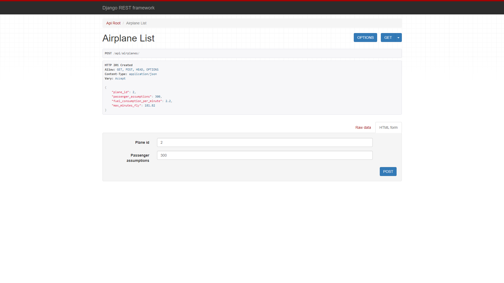

# Welcome to my home challenge project. This is Kami Airplan home challenge project coded by python 3.12 #

## To execute project successfully, following next steps. ##

### 1. Environment Setup ###

- You need to install [python 3.12](https://www.python.org/downloads/release/python-3120/) to run this project from you pc.
- Next, add environment variable to your system.


### 2. Clone from git ###
Go to directory where you are going to clone project and run following command.
```
git clone https://github.com/aputy/kami-airlines-challenge.git

cd kami-airlines-challenge
```

### 3. Install and active venv ###
Run following commands in base directory of cloned project.
```
python -m venv venv

cd venv/Scripts

activate
```

### 4. Run project ###
Run following commands in base directory of cloned project
```
cd main_app

python manage.py makemigrations

python manage.py migrate

python manage.py runserver
```
After running app successfully, you can see this.

Please go to [airplane](http://127.0.0.1:8000/api/airplanes/) page to test functions.

You will see this screen when you enter airplane page 

You can input plane id and passenger assumptions and click post to save new airplane data.
Then you will see this page after success saving data. 

```
{
    "plane_id": 2,
    "passenger_assumptions": 300,
    "fuel_consumption_per_minute": 2.2,
    "max_minutes_fly": 181.82
}
```
- plane_id: plane id inputed from user.
- passenger_assumptions: passenger assumptions inputed from user.
- fuel_consumption_per_minute: This is fuel consumption amount per minute.
- max_minutes_fly: This is max available flying minutes per airplane.

You can add another data using post form.
If you want to see whole data go to [airplane](http://127.0.0.1:8000/api/airplanes/) page again, then you will see like this. 

## Use coverage with testcase ##

### 1. Install coverage ###
```
pip install coverage
```

### 2. Run tests with coverage ###
```
cd main_app

coverage run manage.py test

coverage report -m
```
You can see this result with terminal 

# Thanks for considering my challenge. #